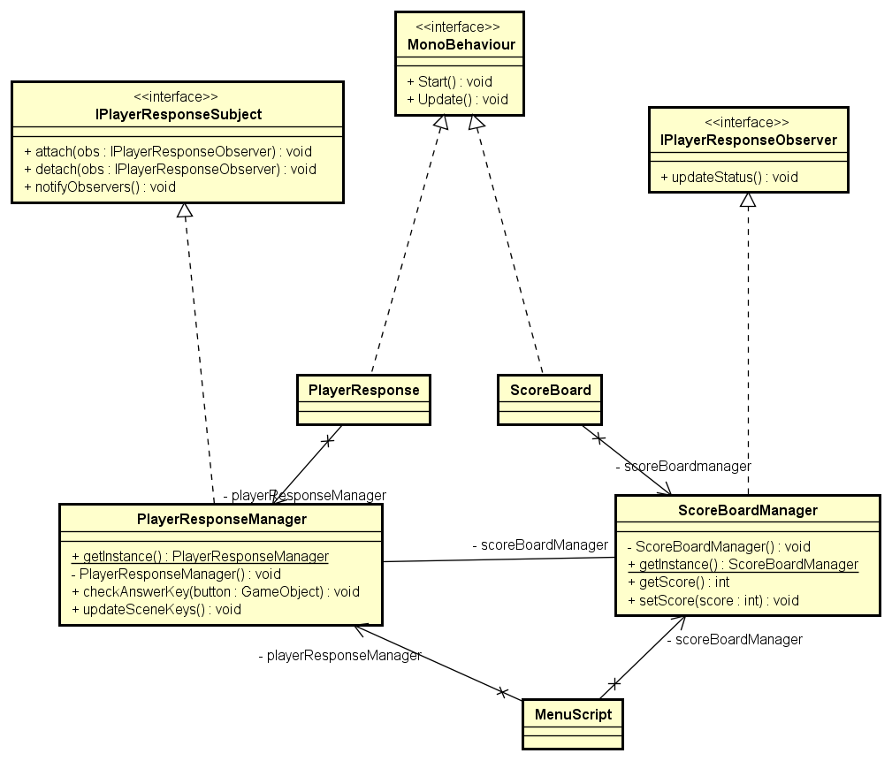

### Use Case Diagram

--

### Activity Diagram

--

### Class Diagram

--

### Class Diagram - Command Pattern Implementation

--

### Class Diagram - Composite Pattern Implementation

--

### Class Diagram - State Pattern Implementation

--

### Class Diagram - Observer Pattern Implementation

--

### Sequence Diagram- Track Score Status

--
### Sequence Diagram - Use Hint

--

### Sequence Diagram - View menu options

--

### Sequence Diagram - View questions

--
